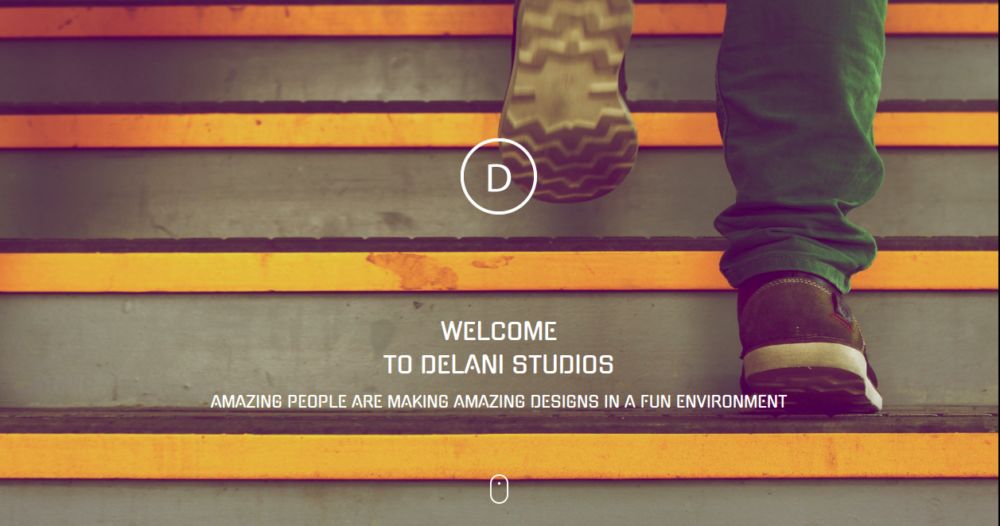
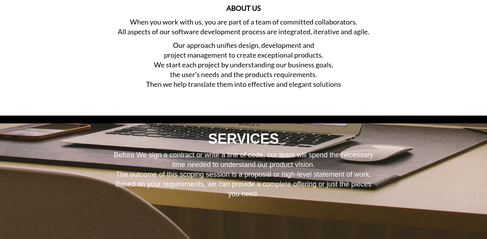
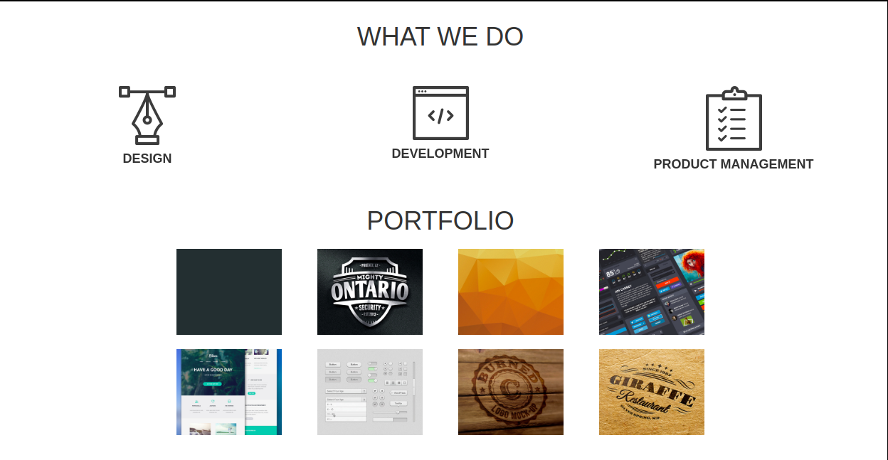

# DELANI STUDIOS

## Project Author

Caroline Nyambura Ireri

## Screenshots

## Description

This is a webpage for Delani studios. It basically shows the services they offer, a portfolio section showing some of their work and a form where you can contact the company.

## Deploying

To view this project, please use this live link. https://carolineireri.github.io/ip_wk3/

## BDD

1. Displays Form on Contact Us section
   - INPUT: "User name."
   - INPUT: "User's email."
   - INPUT: "User's message or feedback."
   - OUTPUT: " It displays a message confirming the user's message has been received."
2. An error Message is displayed if the required inputs are left blank.
   - INPUT: ""
   - OUTPUT: "Error Message is displayed on the respective blank input area."

## Technologies used

- HTML & CSS (Bootstrap)
- FGoogle fonts
- JavaScript (jQuery 3.4.1)

## Known Bugs

No known bugs.

## Contributing changes

To contribute to changes, feel free to fork this project on github and clone it to your local repository. Use this link https://github.com/carolineireri/ip_wk3.
Use the index.html file for the main page.

## Support and Contact details

For any questions,feedback or comment please contact me via email: carolnyamburaireri@gmail.com

## Licence

This project is licensed under the MIT License.
MIT License

Copyright (c) 2019 carolineireri

Permission is hereby granted, free of charge, to any person obtaining a copy of this software and associated documentation files (the "Software"), to deal in the Software without restriction, including without limitation the rights to use, copy, modify, merge, publish, distribute, sublicense, and/or sell copies of the Software, and to permit persons to whom the Software is furnished to do so, subject to the following conditions:

The above copyright notice and this permission notice shall be included in all copies or substantial portions of the Software.

THE SOFTWARE IS PROVIDED "AS IS", WITHOUT WARRANTY OF ANY KIND, EXPRESS OR IMPLIED, INCLUDING BUT NOT LIMITED TO THE WARRANTIES OF MERCHANTABILITY, FITNESS FOR A PARTICULAR PURPOSE AND NONINFRINGEMENT. IN NO EVENT SHALL THE AUTHORS OR COPYRIGHT HOLDERS BE LIABLE FOR ANY CLAIM, DAMAGES OR OTHER LIABILITY, WHETHER IN AN ACTION OF CONTRACT, TORT OR OTHERWISE, ARISING FROM, OUT OF OR IN CONNECTION WITH THE SOFTWARE OR THE USE OR OTHER DEALINGS IN THE SOFTWARE.
